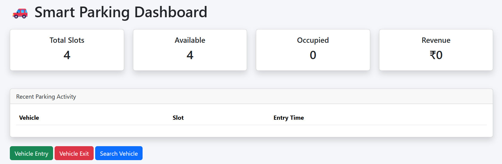
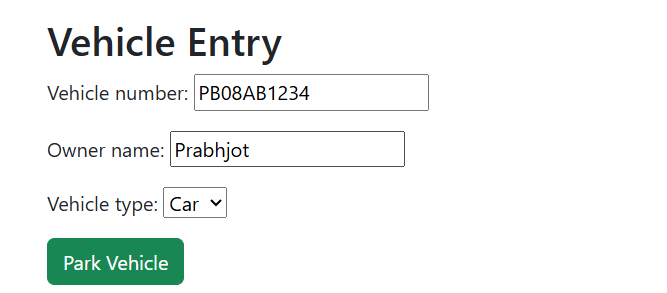
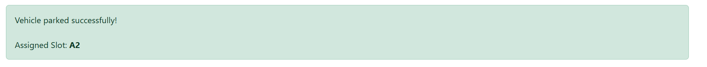
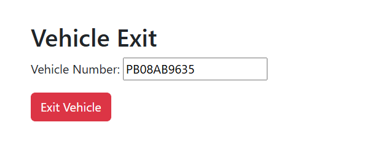
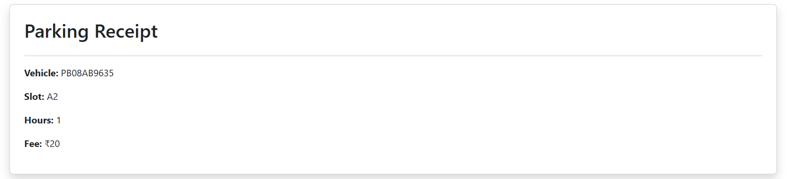
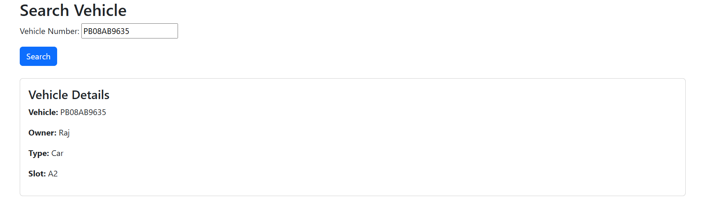
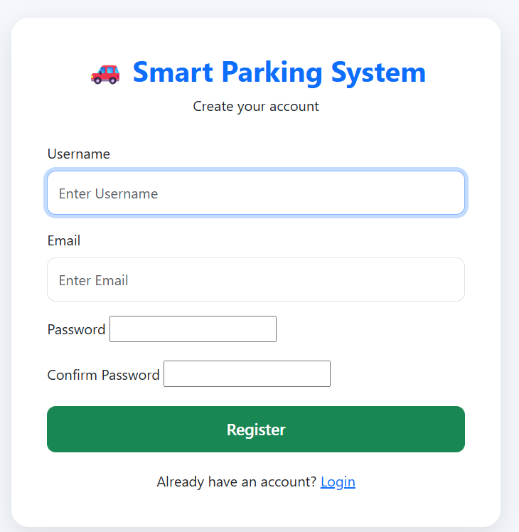
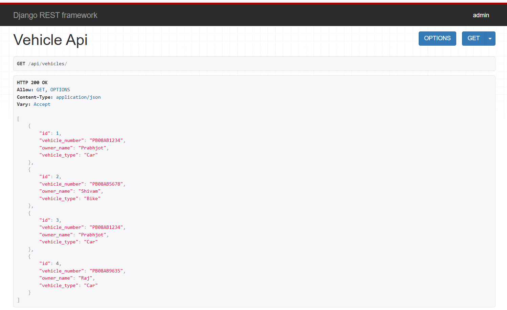

# 🚗 Smart Parking Management System

<p align="center">
  
  
  
  
  
</p>

<p align="center">
  A full-stack parking management solution built with Django and MySQL to automate vehicle entry, exit, parking allocation, fee calculation, and parking analytics.
</p>

---

# 📖 Overview

Smart Parking Management System is a web-based application designed to streamline parking operations by eliminating manual record-keeping and improving parking space utilization.

The system allows users to:

* Register incoming vehicles
* Automatically allocate parking slots
* Process vehicle exits
* Calculate parking fees
* Search vehicle records
* Monitor parking activity through a dashboard
* Access vehicle information through REST APIs

---

# ✨ Key Features

## 🚘 Vehicle Entry Management

* Register incoming vehicles
* Store owner information
* Select vehicle type
* Allocate parking slots automatically

## 🚙 Vehicle Exit Management

* Search vehicle by registration number
* Calculate parking duration
* Generate parking charges
* Release occupied parking slot

## 🔍 Vehicle Search

* Search using vehicle registration number
* View vehicle details
* View owner information
* Track parking slot allocation

## 💰 Parking Fee Calculation

* Automatic fee generation
* Duration-based calculation
* Receipt generation

## 📊 Dashboard Analytics

* Total Parking Slots
* Available Slots
* Occupied Slots
* Parking Activity Tracking
* Revenue Overview

## 🔐 Authentication

* User Registration
* User Login
* User Logout

## 🔌 REST API

Vehicle data can be accessed through REST APIs built using Django REST Framework.

Example:

```http
GET /api/vehicles/
```

---

# 📸 Project Workflow

## Dashboard

Displays parking statistics and recent activity.



---

## Vehicle Entry

Register a new vehicle and allocate a parking slot.



---

## Entry Confirmation

Parking confirmation after successful vehicle registration.



---

## Vehicle Exit

Process vehicle exits using vehicle registration number.



---

## Parking Receipt

Automatically generated parking fee receipt.



---

## Vehicle Search

Search parked vehicles and retrieve details.



---

## User Registration

Secure user registration system.



---

## REST API

Vehicle API endpoint developed using Django REST Framework.



---

# 🏗️ System Architecture

```text
User
 │
 ▼
Django Templates
 │
 ▼
Views
 │
 ▼
Django ORM
 │
 ▼
MySQL Database
 │
 ▼
REST APIs
```

---

# 🛠️ Tech Stack

| Category        | Technology            |
| --------------- | --------------------- |
| Backend         | Python, Django        |
| Database        | MySQL                 |
| API Development | Django REST Framework |
| Frontend        | HTML, CSS, Bootstrap  |
| Authentication  | Django Authentication |
| Version Control | Git, GitHub           |
| IDE             | VS Code               |

---

# 📂 Project Structure

```text
SmartParkingSystem
│
├── accounts/
│
├── parking/
│   ├── models.py
│   ├── views.py
│   ├── forms.py
│   ├── serializers.py
│   └── urls.py
│
├── parking_project/
│
├── assets/
│   ├── dashboard.png
│   ├── vehicle-entry.png
│   ├── entry-success.png
│   ├── vehicle-exit.png
│   ├── vehicle-receipt.png
│   ├── search-vehicle.png
│   ├── register.png
│   └── api.png
│
├── manage.py
├── requirements.txt
└── README.md
```

---

# ⚙️ Installation

### Clone Repository

```bash
git clone https://github.com/YOUR_USERNAME/SmartParkingSystem.git
cd SmartParkingSystem
```

### Create Virtual Environment

```bash
python -m venv venv
```

### Activate Environment

Windows:

```bash
venv\Scripts\activate
```

### Install Dependencies

```bash
pip install -r requirements.txt
```

### Apply Migrations

```bash
python manage.py migrate
```

### Run Development Server

```bash
python manage.py runserver
```

Open:

```text
http://127.0.0.1:8000/
```

---

# 🔌 API Example

### Get All Vehicles

```http
GET /api/vehicles/
```

### Sample Response

```json
[
  {
    "id": 1,
    "vehicle_number": "PB08AB1234",
    "owner_name": "Prabhjot",
    "vehicle_type": "Car"
  }
]
```

---

# 🎯 Learning Outcomes

Through this project, I gained practical experience in:

* Django Project Development
* Database Design using MySQL
* Authentication & Authorization
* CRUD Operations
* Django ORM
* REST API Development
* Bootstrap UI Development
* Git & GitHub Workflow
* Full-Stack Web Application Development

---

# 🚀 Future Enhancements

* QR Code Based Parking Entry
* Online Payment Gateway Integration
* Email Notifications
* Parking Reservation System
* Analytics Dashboard with Charts
* Mobile Responsive Interface
* Vehicle Owner Notifications

---

# 👨‍💻 Developer

**Prabhjot Kaur**

Full Stack Web Development Project built using Django, MySQL, Bootstrap, and Django REST Framework.

---

## ⭐ If you found this project useful, consider giving it a star!
